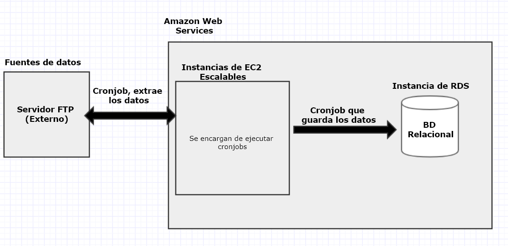

```{r setup, include=FALSE}
knitr::opts_chunk$set(echo = TRUE)
```

**Estudiante:** Merian Herrera Fuentes <br>
**Email:** meryann68@gmail.com <br>
**Cédula:** 207180364 <br>
**Fecha:** "2019/12/14"

### Descripción de la tarea

Escoje una de los proyectos / retos que llegaron a la lista que hicimos en clase. Ahora en mas detalle describe lo siquiente:

### Análisis

 **- Cuáles son los retos para análisis en terminos de metodología y capacidad de cómputo.**
 
 En mi grupo nuestro compañero Brian Duran, nos habló sobre el proyecto en el cúal trabaja actualmente, el cual tiene como propósito procesar datos sobre trading (Marcas Registradas) a nivel de Estados Unidos y tambien a nivel mundial.
 Desde mi punto de vista este proyecto presenta varios retos, entre los retos metológicos que puedo encontrar están:
 
 * Definir una arquitectura relacional para guardar los datos. Nuestro compañero mencionó que utilizan una base de datos relacional, por lo cúal considero que la optimización de los datos y normalización de la misma es un punto que se debe tener presente en cada tarea que se realiza.
 * La validación de los datos. Los datos se extraen de diferentes fuentes, por lo que se deben tener tareas para procesar y eliminar errores que puedan existir en los datos provenientes de cada una de ellas. También, al manejarse datos de diferentes países incluso continentes, se debe tener en cuenta los difentes estándares de cada uno antes de procesar la información y guardarla.
 * Entendimiento del negocio. El propósito final de procesar los datos, es brindarle información a los clientes que deseen registrar un producto, sobre si su producto tiene posibilidades de ser exitoso, si ya hay productos similares... entonces considero esto como un reto, ya que al ser millones de productos que se encuentran registrados a nivel mundial, es todo un reto aprender como funciona la logística de este negocio.
 
 **- Que tipo de soluciones necesitas para solucionarlo (puede ser conceptual, no necesariamente necesitas buscar la tecnologia existente para resolverlo).**
 
 * Definir previamente un estandar para trabajar con los datos, inclusive tener tareas automaticas encargadas de procesar y dar el formato necesario dependiendo de la fuente de los mismos (pais, lugar, institucion..).
 * Tener cron jobs (Tareas programadas) que se encargen de estar revisando las fuentes y procesando los datos conforme van llegando.


### Infraestructura

 **- Cuáles son los retos infraestructurales para trabajar con este tipo de datos**
 
 El mayor reto en cuanto a infraestructura que puedo ver es el poder computacional necesario para procesar los grandes volumenes de datos que les llegan diariamente, ya que son datos provenientes de todo el mundo, y la base de datos además de utilizarse para procesos de ciencia de datos, se utiliza para alimentar otras aplicaciones de la empresa dónde los clientes pueden ver el estado de sus solicitudes, por lo cuál deben procesarse todos los volumnes de datos entrantes lo más antes posible.
 Asímismo, el  compañero mencionó que todos los servidores que manejan se encuentran en la nube, por lo cuál considero que mantener esa infraestructura para procesar y almacenar datos en servicios como AWS, Azure, Google Cloud... representa un costo moneitario alto para la empresa.
 
 **- Que tipo de soluciones necesitas para solucionarlo (puede ser conceptual, no necesariamente necesitas buscar la tecnologia existente para resolverlo).**
 
  * Tener una arquitectura escalable en los servidores, que pueda brindar el poder computacional necesario segun la demanda del mismo. EC2 es una herramienta en AWS que nos permite configurar de manera fácil y rápida la escalabilidad de nuestros servidores, de manera que podemos tener de 1 a N instancias segun la latencia u otros parámetros de nuestros servidores.
 
 
**- Crea un diagrama de la solución como lo piensas (entrega la imagen o incluyela como imagen en el Rmarkdown).**

{width=95%}
 
