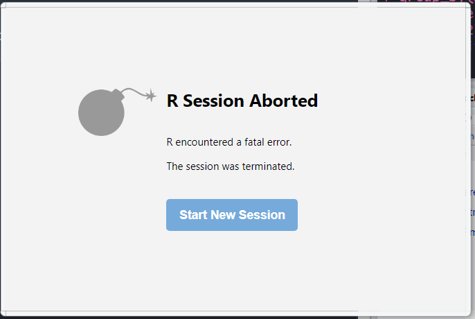

**Estudiante:** Merian Herrera Fuentes <br>
**Email:** meryann68@gmail.com <br>
**Cédula:** 207180364 <br>
**Fecha:** "2019/12/14"

### Descripción de la tarea

Levanta una instancia local de Spark ([siguiendo los pasos aqui]()) y ejecuta los siguientes pasos. Puedes usar el marco de codigo (el *chunk*) para incluir tu respuesta y enviar la tarea finalizada.

```{r}
# library(SparkR)
library(sparklyr)
library(nycflights13)
library(dplyr)
```

```{r}
# sparkR.session(master = "local[*]", sparkConfig = list(spark.driver.memory = "1g"))
sc <- spark_connect(master = "local")
```


## Copia datos

```{r}

# aqui el codigo para copiar nycflights13::flights a Spark
# vuelos <- as.DataFrame(flights)
vuelos <- copy_to(sc, nycflights13::flights, "flights")

# aqui el codigo para copiar nycflights13::airlines a Spark
# aerolineas <- as.DataFrame(airlines)
aerolineas <- copy_to(sc, nycflights13::airlines, "airlines")

```

```{r}
head(vuelos)
# printSchema(vuelos)
```

```{r}
head(aerolineas)
# printSchema(aerolineas)
```


Pregunta: 

> ¿Cuántos RDD creó el paso anterior?

Para responder esta pregunta, primeramente tuve que investigar sobre los RDD para entender qué son y como puedo contar cuántos fueron creados en el paso anterior.
Segun mi investigación los RDD (Resilient Distributed Dataset) son los objetos sobre los cuáles estan basados los dataframes de Spark, y en las versiones anteriores de spark interactuabamos directamente con ellos, en las nuevas versiones que tenemos ya no necesitamos trabajar de manera directa con los RDD, si no que ya podemos acceder a columnas y filas de cada dataframe.
Lástimosamente no pude encontrar una herramienta o linea de código que me ayudara a contar los RDD de mi dataframe con R. Sin embargo, según entendí, Spark crea un RDD por cada fila del dataframe por lo cuál si contamos las filas vamos a tener la cantidad de RDD creados.


```{r}
count(vuelos)
```

```{r}
count(aerolineas)
```

En nuestro caso tenemos 336776 filas para vuelos y 16 para aerolineas, por lo cuál podemos asumir que son la misma cantidad de RDD creados en el paso anterior para cada dataframe.

### Ejecuta un join sobre spark

**Nota:** Como se esta utilizando el paquete *sparlyr* las consultas sobre los dataframes se pueden hacer utilizando *dplyr*.


```{r}
# join (sobre spark) de vuelos y aerolineas

datos_completos = left_join(vuelos, aerolineas, by = 'carrier')
datos_completos
```

```{r}
src_tbls(sc)
```

### Ejecuta un group_by sobre spark

```{r}
# group_by por aerolinea reportando promedio de lo retrasos

datos_completos %>%
group_by(name) %>%
summarize(promedio_retrasos = round(mean(dep_delay, na.rm = TRUE), 2))
```

Pregunta:

> ¿Qué pasa cuando cierras la sesión y la vuelves a abrir? 

```{r}
# Cerrar sesion de Spark
spark_disconnect(sc) 

# Iniciar de nuevo la sesion de Spark
sc <- spark_connect(master = "local")
```


Cuándo se cierra la sesion de Spark y se vuelve a abrir, R studio crea una nueva sesión, y si se intenta ejecutar uno de los chunks anteriores, se muetra un error que dice que la sesion de R ha sido terminada.

{width=95%}


> ¿Están los resultados que tenías antes aun en tu instancia de Spark? 

No, al ser una nueva instancia los resultados y datos ejecutados en los pasos anteriores no estan.

> Explica lo que observas.

Según  lo observado, puedo deducir que Spark trabaja por sesiones y que de alguna manera necesitamos guardar o hacer commit de las modificaciones a los datos que hemos hecho para que los datos no se pierdan al cerrar o terminar una sesión.
